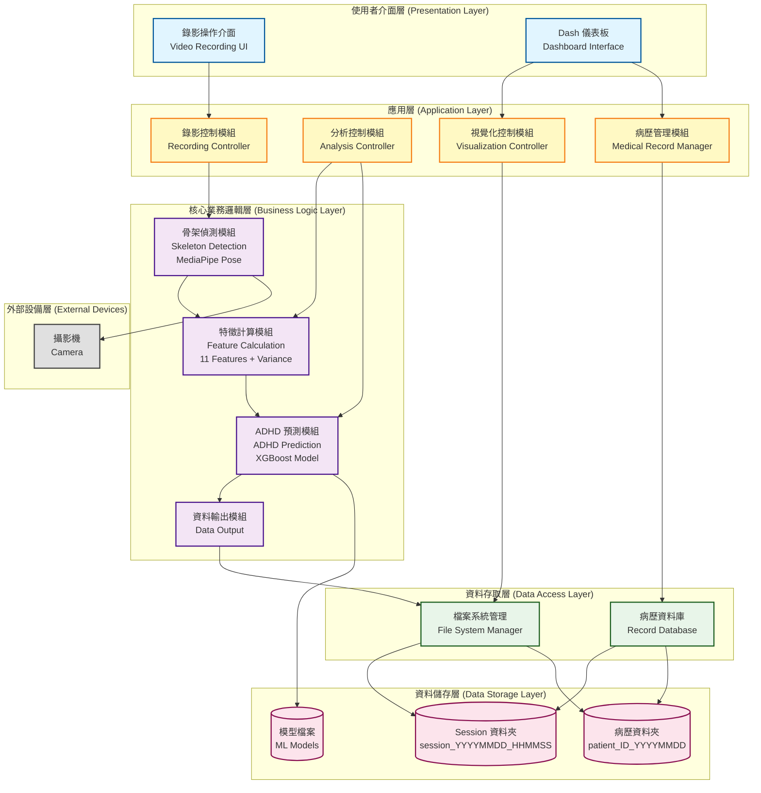
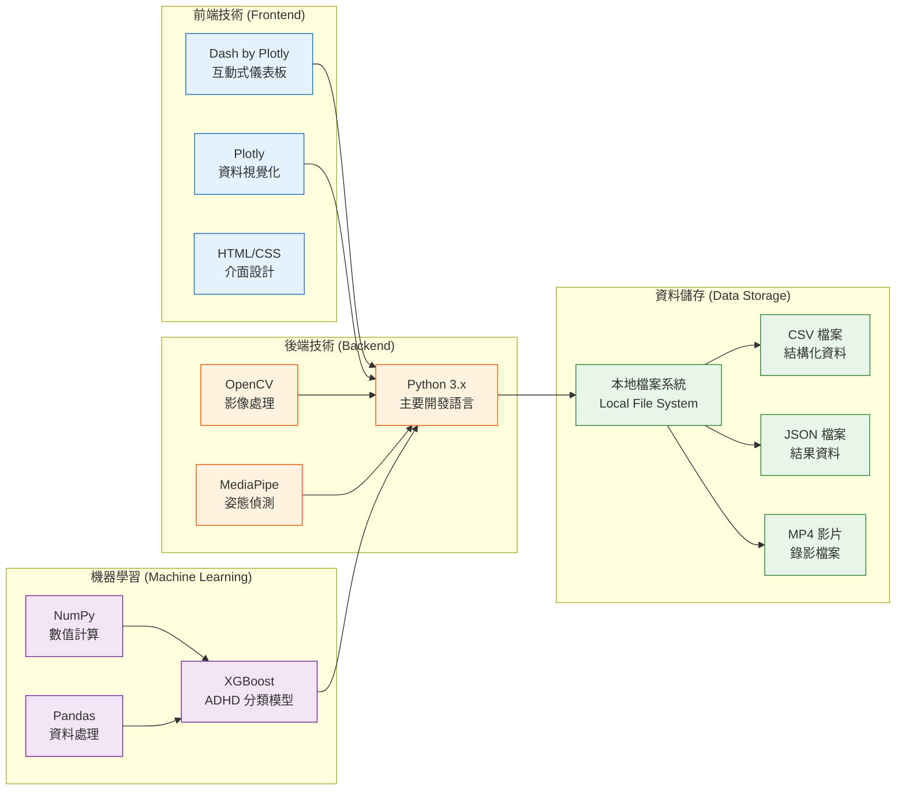
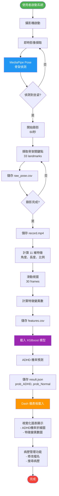
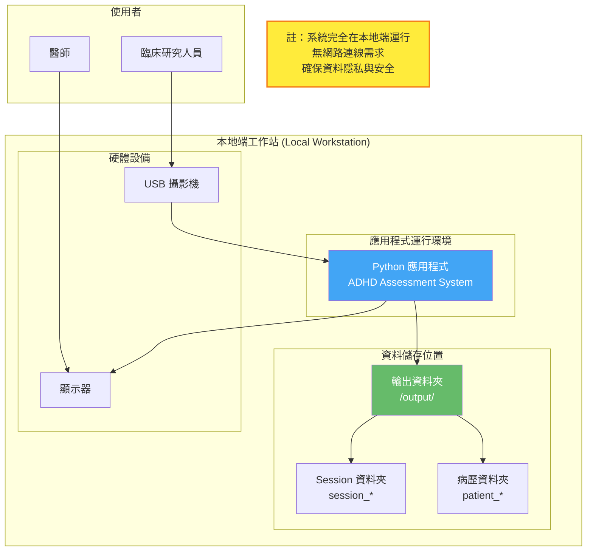
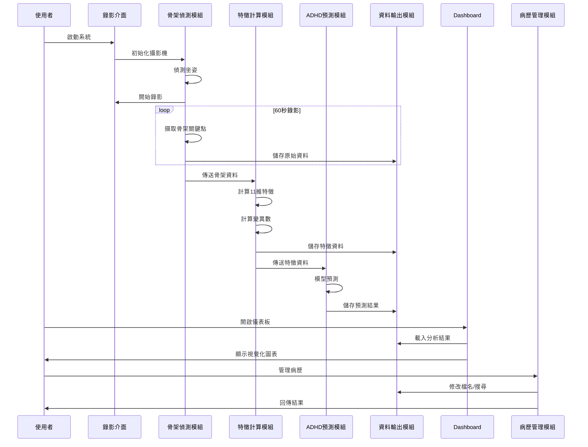
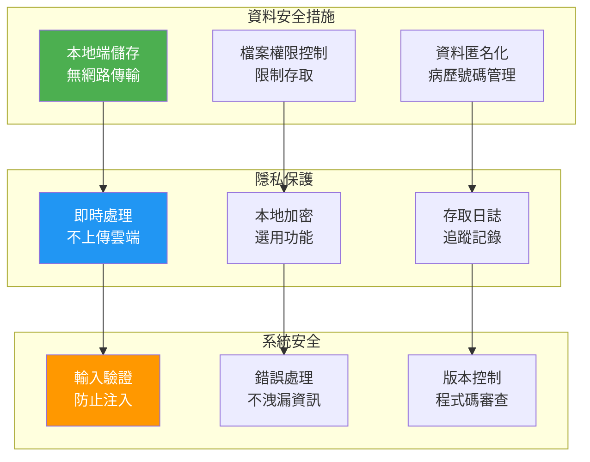

# 系統架構圖 (System Architecture Diagram)

## 智慧型兒童ADHD風險評估系統 - 系統架構

本文件描述智慧型兒童ADHD風險評估系統的整體架構設計，包含系統層次、技術堆疊、模組關係及資料流向。

---

## 系統架構總覽

---

## 技術堆疊 (Technology Stack)

---

## 系統資料流程架構

---

## 部署架構 (Deployment Architecture)

---

## 模組互動架構

---

## 安全性架構

---

## 系統架構特點

### 1. 分層架構設計
- **使用者介面層**：提供直覺的操作介面
- **應用層**：協調各模組運作
- **核心業務邏輯層**：實現主要功能
- **資料存取層**：統一資料存取介面
- **資料儲存層**：本地端檔案儲存

### 2. 模組化設計
- 各模組獨立開發、測試、維護
- 低耦合、高內聚
- 易於擴充新功能

### 3. 本地端部署
- 無需網路連線
- 資料不上傳雲端
- 保護病患隱私
- 符合醫療資料安全規範

### 4. 即時處理能力
- 即時骨架偵測（< 5秒）
- 快速分析結果（< 30秒）
- 即時視覺化顯示

### 5. 可擴充性
- 支援新增特徵項目
- 支援更新 ML 模型
- 支援整合其他分析工具

---

## 技術實作細節

### 核心技術選擇理由

| 技術 | 選擇理由 |
|------|---------|
| **Python** | 豐富的科學計算與機器學習生態系 |
| **MediaPipe Pose** | 高效的即時骨架偵測，準確度高 |
| **XGBoost** | 優秀的表格資料分類性能 |
| **Dash** | 快速建立互動式儀表板 |
| **OpenCV** | 成熟的影像處理函式庫 |
| **本地檔案系統** | 無需資料庫，簡化部署，提高隱私 |

### 效能考量

- **即時處理**：使用 GPU 加速（如可用）
- **記憶體管理**：串流處理影像，避免記憶體溢位
- **檔案 I/O**：批次寫入，減少磁碟操作
- **並行處理**：使用多執行緒處理獨立任務

---

## 與其他文件的對應關係

本系統架構圖與其他文件的關聯：

- **DFD 圖** (dfd.md)：著重資料流動，本架構圖著重系統結構
- **UML 類別圖** (hw5.md)：詳細類別設計，本架構圖呈現模組層次
- **使用案例圖** (hw3.md)：使用者視角，本架構圖呈現技術視角
- **循序圖與活動圖** (hw5.md)：動態行為，本架構圖呈現靜態結構
- **ERD 圖** (hw7.md)：資料關係，本架構圖呈現系統元件

---

## 未來擴充方向

1. **支援多攝影機**：同時從不同角度錄影分析
2. **深度學習模型**：整合 CNN/RNN 提升預測準確度
3. **雲端備份**（選用）：加密備份至私有雲
4. **多語言介面**：支援中英文切換
5. **報表自動生成**：產生 PDF 臨床報告
6. **整合其他生理訊號**：心率、眼動追蹤等

---

## 版本資訊

- **版本**：1.0
- **更新日期**：2025-12-29
- **維護者**：智慧型兒童ADHD風險評估系統開發團隊
