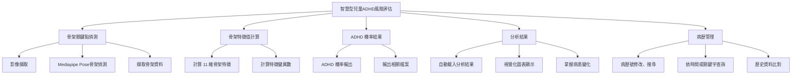
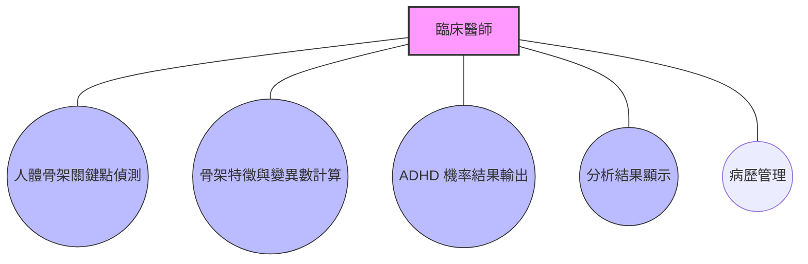
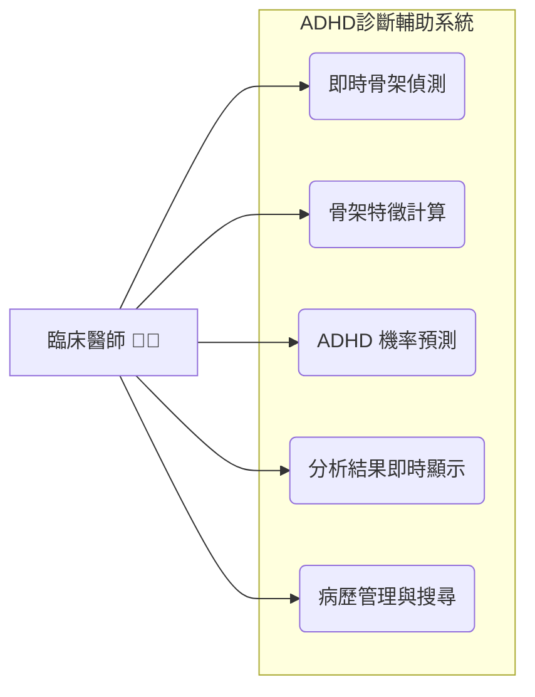

# 🧠 智慧型兒童ADHD風險評估系統

## 📘 功能性需求
### 1.人體骨架關鍵點偵測
● 進行即時影像擷取  
● 使用 Mediapipe Pose 偵測受試者骨架關鍵點  
● 擷取骨架關鍵點資料作分析輸入
### 2.骨架特徵與變異數計算
● 依據文獻定義計算 11 維骨架特徵（角度、長度等）  
● 以滑動視窗計算特徵變異數
### 3.ADHD 機率預測與結果輸出
● 匯入訓練完成的模型，輸出 ADHD機率  
● 輸出相關原始骨架序列、特徵變異數資料＆ADHD 機率結果等檔案
### 4.分析結果即時顯示
● 自動載入最新分析結果  
● 顯示ADHD機率折線圖＆特徵變異數視覺化圖表  
● 讓使用者即時掌握受試者狀態變化
### 5.病歷管理與搜尋
● 依病歷號碼命名、修改、搜尋及儲存功能  
● 搜尋與篩選功能支援依時間或關鍵字查詢  
● 方便臨床人員快速查找與比對歷史資料
## 📘 非功能性需求
### 1.效能需求
● 系統需在5秒內即時顯示骨架追蹤畫面  
● 錄影結束後30秒內完成分析與結果輸出，確保即時性與臨床應用效率
### 2.可用性需求
● 系統介面直覺且簡易操作，醫師能在無程式背景下亦操作  
● 分析結果以圖表化方式清楚呈現，方便快速理解與判讀
### 3.可維護性與擴充性
● 採模組化程式架構，便於後續維護與功能擴充  
● 系統應可快速更新模型或新增骨架特徵項目，以支援研究與臨床需求
### 4.資料儲存安全性
● 所有錄影影像與分析結果均需儲存於本地端指定資料夾  
● 確保資料不經網路傳輸，以維護病歷及個資安全
## 🧩 系統功能分解圖

## 📊 使用案例圖

## :wrench: 使用案例說明
### 使用案例 1：偵測骨架關鍵點
 | 使用案例名稱 | 偵測骨架關鍵點 |
 |---|:---|
 | 主要參與者 | 臨床研究人員 |
 | 目標說明 | 即時擷取影像並偵測受試者骨架關鍵點資料 |
 | 前置條件 | 攝影鏡頭與 Mediapipe Pose 模組已啟動 |
 | 後置條件 | 成功產出骨架關鍵點座標資料 |
 | 主要流程 | 1. 使用者啟動偵測功能  2. 系統即時擷取影像  3. Mediapipe Pose 偵測骨架關鍵點  4. 儲存結果供分析使用 |
 
### 使用案例 2：骨架特徵與變異數計算
 | 使用案例名稱 | 骨架特徵與變異數計算 |
 |---|:---|
 | 主要角色 | 系統分析模組 |
 | 目標說明 | 根據偵測資料自動計算骨架特徵與變異數 |
 | 前置條件 | 已取得骨架關鍵點資料 |
 | 後置條件 | 輸出 11 維骨架特徵與變異數結果 |
 | 主要流程 | 1. 系統讀取骨架關鍵點資料  2. 依文獻定義計算角度、長度等特徵  3. 使用滑動視窗計算特徵變異數  4. 輸出特徵資料供模型輸入 |
 
 ### 使用案例 3：ADHD 機率預測與結果輸出
 | 使用案例名稱 | ADHD 機率預測與結果輸出 |
 |---|:---|
 | 主要參與者 | 臨床研究人員＆AI 模型系統 |
 | 目標說明 | 透過訓練模型預測受試者的 ADHD 機率並輸出分析結果 |
 | 前置條件 | 模型已訓練完成且特徵資料可供輸入 |
 | 後置條件 | 產出 ADHD 機率、原始骨架序列與特徵變異數等輸出檔案 |
 | 主要流程 | 1. 系統匯入訓練完成的模型  2. 輸入骨架特徵與變異數資料  3. 模型進行 ADHD 機率預測  4. 系統輸出 ADHD 機率與對應分析結果 |

 ### 使用案例 4：分析結果即時顯示
 | 使用案例名稱 | 分析結果即時顯示 |
 |---|:---|
 | 主要參與者 | 臨床研究人員 |
 | 目標說明 | 即時呈現 ADHD 機率與特徵變異數變化 |
 | 前置條件 | 系統已完成分析並產出結果檔案 |
 | 後置條件 | ADHD 機率折線圖與特徵變異數視覺化圖表顯示於管理介面 |
 | 主要流程 | 1. 系統自動載入最新分析結果  2. 顯示 ADHD 機率折線圖  3. 顯示特徵變異數視覺化圖表  4. 使用者可即時觀察狀態變化 |

 ### 使用案例 5：病歷管理與搜尋
 | 使用案例名稱 | 病歷管理與搜尋 |
 |---|:---|
 | 主要參與者 | 臨床研究人員 |
 | 目標說明 | 管理與搜尋受試者病歷資料 |
 | 前置條件 | 系統內已有儲存的病歷資料 |
 | 後置條件 | 成功顯示或修改目標病歷資料 |
 | 主要流程 | 1. 使用者輸入病歷號碼或關鍵字  2. 系統搜尋符合條件的病歷資料  3. 顯示查詢結果  4. 允許修改、重新命名或儲存  5. 支援依時間或關鍵字篩選功能 |
