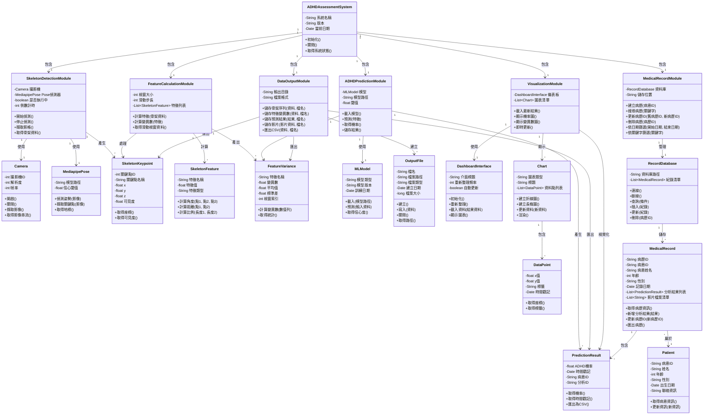
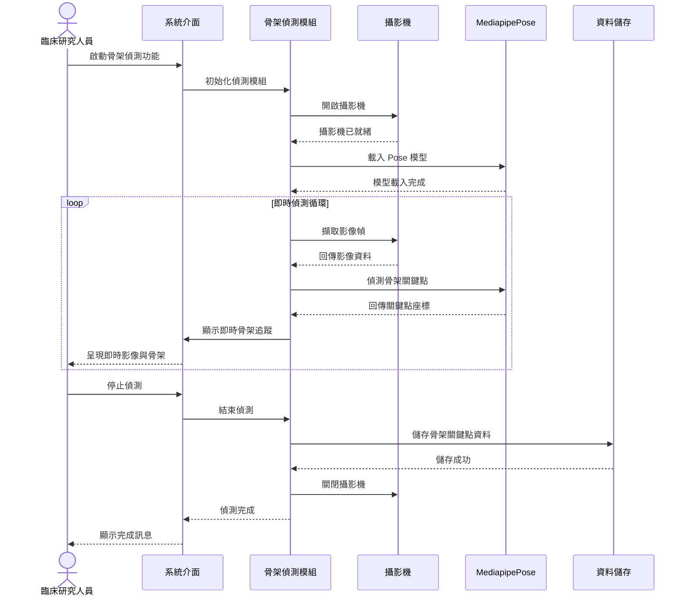
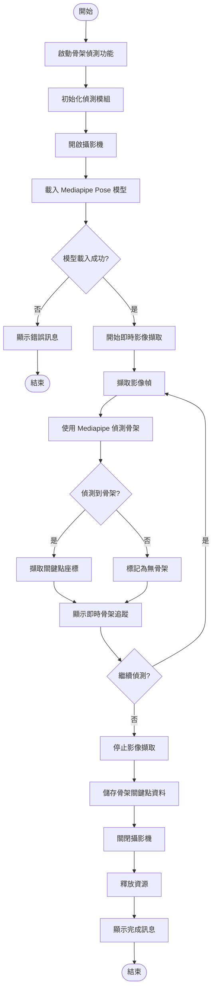
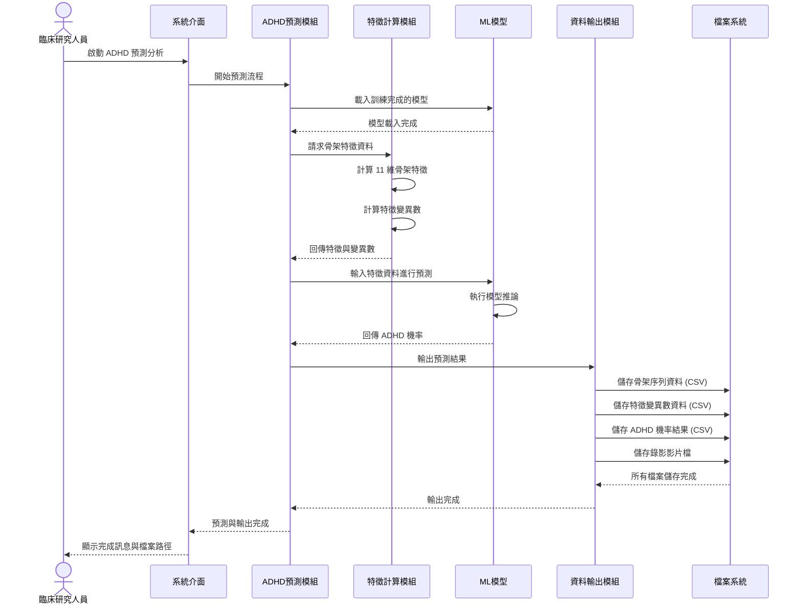
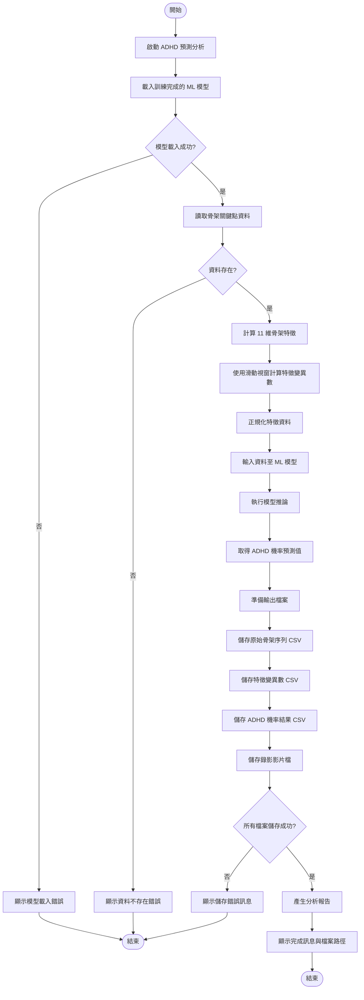
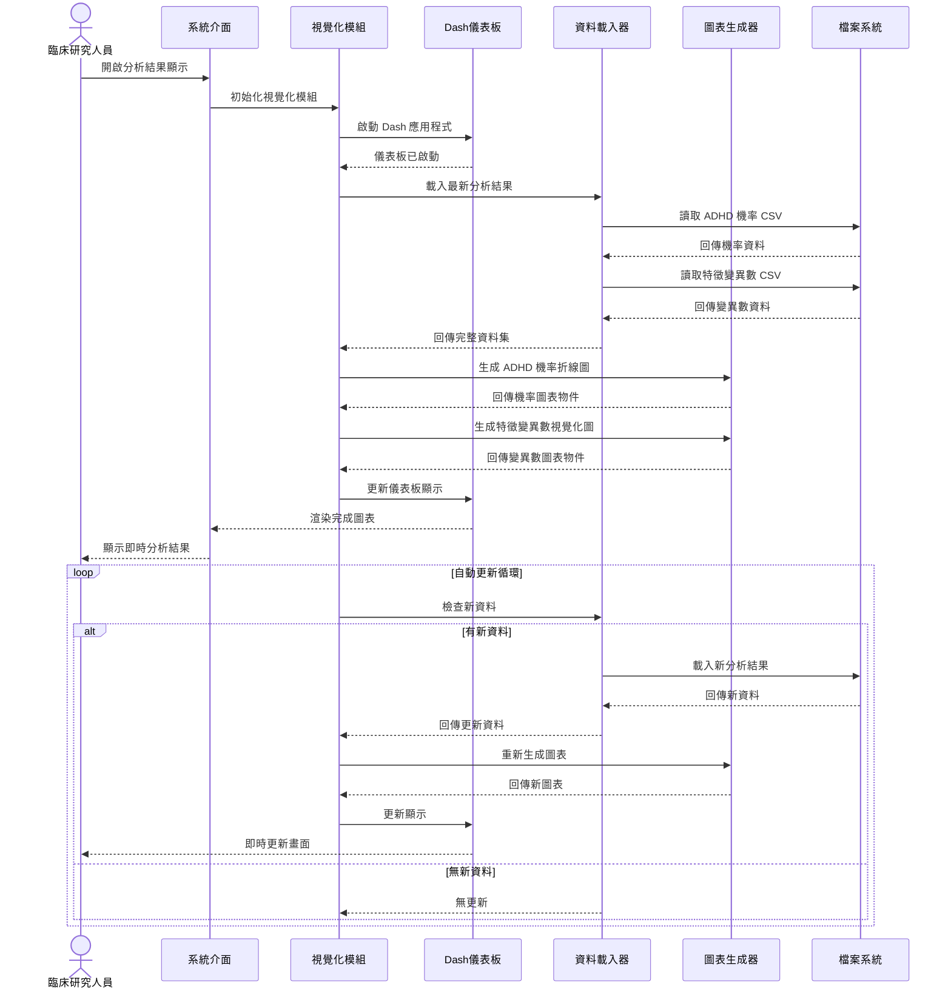
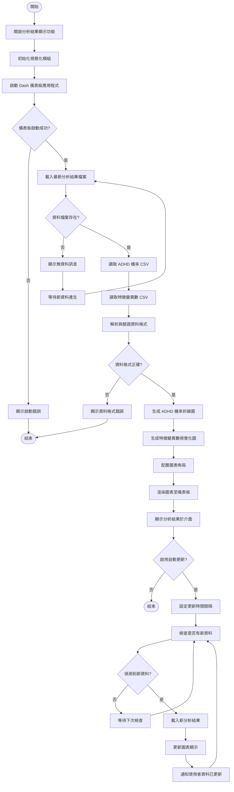
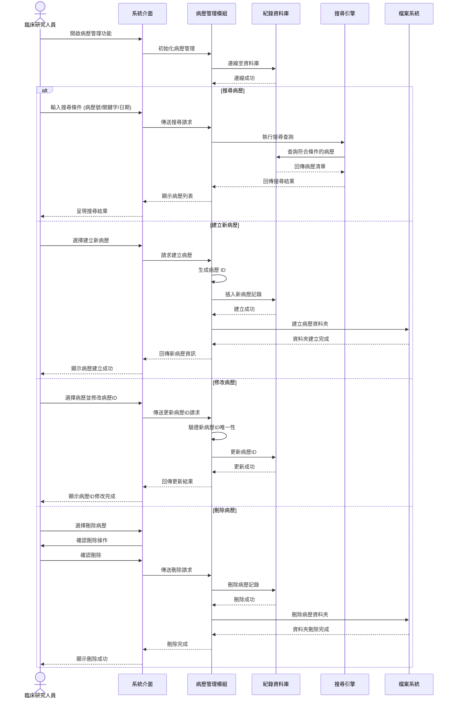
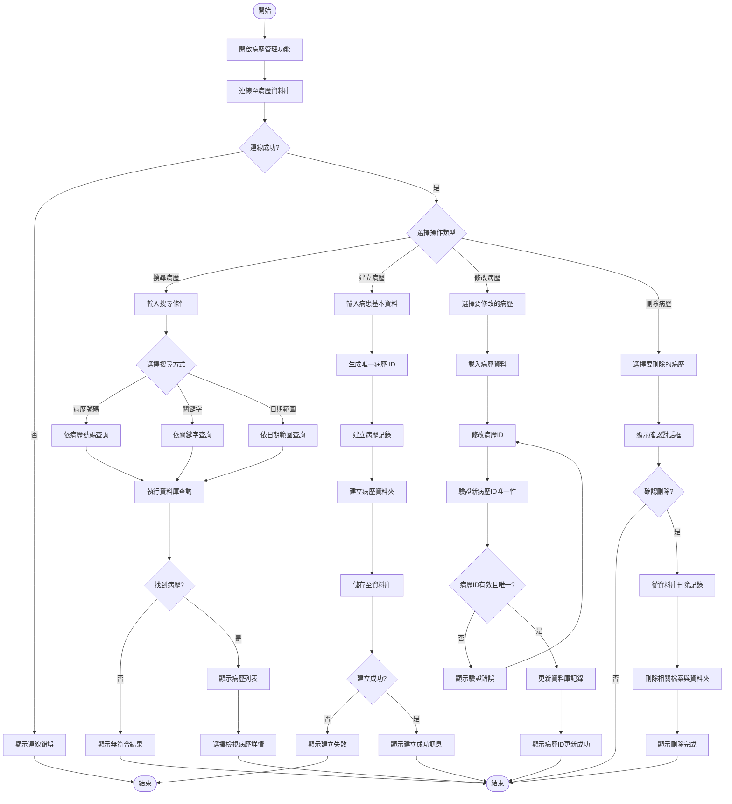

# UML 類別圖

## 智慧型兒童 ADHD 風險評估系統

## 類別說明

### 主要模組

1. **ADHD評估系統 (主系統)**
   - 系統的核心控制類別，負責整合所有子模組。

2. **骨架偵測模組**
   - 負責即時影像擷取與骨架關鍵點偵測。
   - 使用 Mediapipe Pose 進行人體姿態識別。

3. **特徵計算模組**
   - 計算 11 維骨架特徵（角度、長度等）。
   - 使用滑動視窗計算特徵變異數。

4. **ADHD預測模組**
   - 載入訓練好的機器學習模型。
   - 輸出 ADHD 風險機率。

5. **資料輸出模組**
   - 儲存原始骨架序列、特徵變異數、ADHD 機率結果。
   - 匯出 CSV 檔案與錄影影片。

6. **視覺化模組**
   - 整合儀表板介面顯示即時分析結果。
   - 呈現 ADHD 機率折線圖與特徵變異數圖表。

7. **病歷管理模組**
   - 病歷資料的建立、搜尋、修改、刪除。
   - 支援依時間或關鍵字查詢。

### 支援類別

- **攝影機**: 攝影機控制。
- **Mediapipe姿態偵測**: Mediapipe 姿態偵測引擎。
- **骨架關鍵點**: 骨架關鍵點資料結構。
- **骨架特徵**: 骨架特徵（角度、距離、比例等）。
- **特徵變異數**: 特徵變異數統計。
- **機器學習模型**: 機器學習模型。
- **預測結果**: ADHD 預測結果。
- **輸出檔案**: 輸出檔案管理。
- **儀表板介面**: 儀表板互動式介面。
- **圖表**: 圖表物件。
- **資料點**: 圖表資料點。
- **紀錄資料庫**: 病歷資料庫。
- **病歷記錄**: 病歷記錄。
- **病患**: 病患資訊。

## 設計重點

1. **模組化設計**: 系統分為六大模組，各司其職，易於維護與擴充。
2. **資料流動**: 從影像擷取 → 骨架偵測 → 特徵計算 → 模型預測 → 結果視覺化。
3. **本地儲存**: 所有資料均儲存於本地端，確保個資安全。
4. **即時顯示**: 支援即時分析結果呈現，方便臨床觀察。
5. **病歷管理**: 完整的病歷管理功能，支援搜尋與查詢。

## 符合需求

此 UML 類別圖涵蓋了所有功能性需求：
- 人體骨架關鍵點偵測
- 骨架特徵與變異數計算
- ADHD 機率預測與結果輸出
- 分析結果即時顯示
- 病歷管理與搜尋

以及非功能性需求：
- 效能需求（即時處理）
- 可用性需求（清晰的介面設計）
- 可維護性與擴充性（模組化架構）
- 資料儲存安全性（本地儲存）

---

# 循序圖與活動圖

## 使用案例 1：偵測骨架關鍵點

### 循序圖 (Sequence Diagram)

### 活動圖 (Activity Diagram)

---

## 使用案例 2：ADHD 機率預測與結果輸出

### 循序圖 (Sequence Diagram)

### 活動圖 (Activity Diagram)

---

## 使用案例 3：分析結果即時顯示

### 循序圖 (Sequence Diagram)

### 活動圖 (Activity Diagram)

---

## 使用案例 4：病歷管理與搜尋

### 循序圖 (Sequence Diagram)

### 活動圖 (Activity Diagram)

