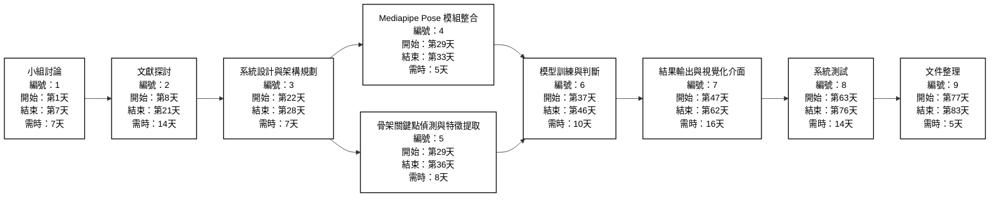
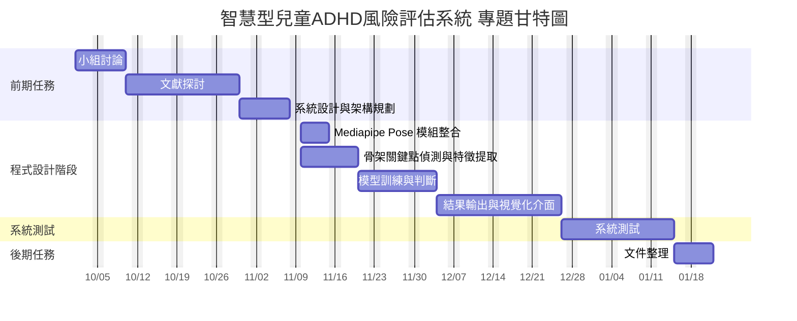

## 工作分配
| 工作項目                  | 阮均婗 | 陳芃妤 | 蘇子凡 |
|---------------------------|:--------:|:--------:|:--------:|
| 組長                      | ✔️     |        |        |
| 文獻探討                   | ✔️     | ✔️    |        |
| 小組討論                   | ✔️     | ✔️    | ✔️     |
| 程式設計                   | ✔️     |        |        |
| 系統測試                   | ✔️     |        |        |
| 小組GitHub製作             | ✔️     | ✔️     | ✔️    |
| 簡報製作                   |        | ✔️     | ✔️    |
| 影片製作                   |        |        | ✔️     |
| 報告                      |        | ✔️     | ✔️     |

## PERT/CPM 圖

### 關鍵路徑：1 → 2 → 3 → 5→6 → 8 → 9

## 甘特圖

