# UML 類別圖 (Class Diagram)

## 智慧型兒童ADHD風險評估系統

```mermaid
classDiagram
    %% 主系統類別
    class ADHDAssessmentSystem {
        -String systemName
        -String version
        -Date currentDate
        +initialize()
        +shutdown()
        +getSystemStatus()
    }

    %% 骨架偵測模組
    class SkeletonDetectionModule {
        -Camera camera
        -MediapipePose poseDetector
        -boolean isRunning
        -int countdownTimer
        +startDetection()
        +stopDetection()
        +captureFrame()
        +getSkeletonData()
    }

    class Camera {
        -int cameraID
        -int resolution
        -int frameRate
        +open()
        +close()
        +captureImage()
        +getVideoStream()
    }

    class MediapipePose {
        -String modelPath
        -float confidenceThreshold
        +detectPose(image)
        +extractKeypoints(image)
        +getLandmarks()
    }

    class SkeletonKeypoint {
        -int keypointID
        -String keypointName
        -float x
        -float y
        -float z
        -float visibility
        +getCoordinates()
        +getVisibility()
    }

    %% 特徵計算模組
    class FeatureCalculationModule {
        -int windowSize
        -int slideStep
        -List~SkeletonFeature~ features
        +calculateFeatures(skeletonData)
        +calculateVariance(features)
        +getSlidingWindowData()
    }

    class SkeletonFeature {
        -String featureName
        -float featureValue
        -String featureType
        +calculateAngle(point1, point2, point3)
        +calculateDistance(point1, point2)
        +calculateRatio(length1, length2)
    }

    class FeatureVariance {
        -String featureName
        -float variance
        -float mean
        -float stdDev
        -int windowIndex
        +computeVariance(values)
        +getStatistics()
    }

    %% ADHD預測模組
    class ADHDPredictionModule {
        -MLModel model
        -String modelPath
        -float threshold
        +loadModel()
        +predict(features)
        +getProbability()
        +saveResults()
    }

    class MLModel {
        -String modelType
        -String modelVersion
        -Date trainedDate
        +load(modelPath)
        +predict(inputData)
        +getConfidence()
    }

    class PredictionResult {
        -float adhdProbability
        -Date timestamp
        -String patientID
        -String analysisID
        +getProbability()
        +getTimestamp()
        +exportToCSV()
    }

    %% 資料輸出模組
    class DataOutputModule {
        -String outputDirectory
        -String fileFormat
        +saveSkeletonSequence(data, filename)
        +saveFeatureVariance(data, filename)
        +savePredictionResult(result, filename)
        +saveVideo(videoData, filename)
        +exportCSV(data, filename)
    }

    class OutputFile {
        -String fileName
        -String filePath
        -String fileType
        -Date createdDate
        -long fileSize
        +create()
        +write(data)
        +close()
        +getPath()
    }

    %% 視覺化與管理介面模組
    class VisualizationModule {
        -DashboardInterface dashboard
        -List~Chart~ charts
        +loadLatestResults()
        +displayProbabilityChart()
        +displayVarianceChart()
        +updateRealtime()
    }

    class DashboardInterface {
        -String interfaceTitle
        -int refreshRate
        -boolean autoUpdate
        +initialize()
        +refresh()
        +loadData(resultData)
        +displayCharts()
    }

    class Chart {
        -String chartType
        -String title
        -List~DataPoint~ dataPoints
        +createLineChart()
        +createBarChart()
        +updateData(newData)
        +render()
    }

    class DataPoint {
        -float xValue
        -float yValue
        -String label
        -Date timestamp
        +getCoordinates()
        +getLabel()
    }

    %% 病歷管理模組
    class MedicalRecordModule {
        -RecordDatabase database
        -String storageLocation
        +createRecord(patientID)
        +searchRecord(keyword)
        +updateRecord(recordID, data)
        +deleteRecord(recordID)
        +filterByDate(startDate, endDate)
        +filterByKeyword(keyword)
    }

    class RecordDatabase {
        -String databasePath
        -List~MedicalRecord~ records
        +connect()
        +disconnect()
        +query(criteria)
        +insert(record)
        +update(record)
        +delete(recordID)
    }

    class MedicalRecord {
        -String recordID
        -String patientID
        -String patientName
        -int age
        -String gender
        -Date recordDate
        -List~PredictionResult~ analysisResults
        -List~String~ videoFiles
        +getRecordInfo()
        +addAnalysisResult(result)
        +updatePatientInfo(info)
        +exportRecord()
    }

    class Patient {
        -String patientID
        -String name
        -int age
        -String gender
        -Date birthDate
        -String contactInfo
        +getPatientInfo()
        +updateInfo(newInfo)
    }

    %% 關聯關係
    ADHDAssessmentSystem "1" --> "1" SkeletonDetectionModule : contains
    ADHDAssessmentSystem "1" --> "1" FeatureCalculationModule : contains
    ADHDAssessmentSystem "1" --> "1" ADHDPredictionModule : contains
    ADHDAssessmentSystem "1" --> "1" DataOutputModule : contains
    ADHDAssessmentSystem "1" --> "1" VisualizationModule : contains
    ADHDAssessmentSystem "1" --> "1" MedicalRecordModule : contains

    SkeletonDetectionModule "1" --> "1" Camera : uses
    SkeletonDetectionModule "1" --> "1" MediapipePose : uses
    SkeletonDetectionModule "1" --> "*" SkeletonKeypoint : generates

    FeatureCalculationModule "1" --> "*" SkeletonFeature : calculates
    FeatureCalculationModule "1" --> "*" FeatureVariance : produces
    FeatureCalculationModule --> SkeletonKeypoint : processes

    ADHDPredictionModule "1" --> "1" MLModel : uses
    ADHDPredictionModule "1" --> "*" PredictionResult : generates
    ADHDPredictionModule --> FeatureVariance : analyzes

    DataOutputModule "1" --> "*" OutputFile : creates
    DataOutputModule --> PredictionResult : exports
    DataOutputModule --> SkeletonKeypoint : exports
    DataOutputModule --> FeatureVariance : exports

    VisualizationModule "1" --> "1" DashboardInterface : uses
    VisualizationModule "1" --> "*" Chart : displays
    Chart "1" --> "*" DataPoint : contains
    VisualizationModule --> PredictionResult : visualizes

    MedicalRecordModule "1" --> "1" RecordDatabase : manages
    RecordDatabase "1" --> "*" MedicalRecord : stores
    MedicalRecord "*" --> "1" Patient : belongs to
    MedicalRecord "1" --> "*" PredictionResult : contains
```

## 類別說明

### 主要模組

1. **ADHDAssessmentSystem (主系統)**
   - 系統的核心控制類別，負責整合所有子模組

2. **SkeletonDetectionModule (骨架偵測模組)**
   - 負責即時影像擷取與骨架關鍵點偵測
   - 使用 Mediapipe Pose 進行人體姿態識別

3. **FeatureCalculationModule (特徵計算模組)**
   - 計算 11 維骨架特徵（角度、長度等）
   - 使用滑動視窗計算特徵變異數

4. **ADHDPredictionModule (ADHD預測模組)**
   - 載入訓練好的機器學習模型
   - 輸出 ADHD 風險機率

5. **DataOutputModule (資料輸出模組)**
   - 儲存原始骨架序列、特徵變異數、ADHD機率結果
   - 輸出 CSV 檔案與錄影影片

6. **VisualizationModule (視覺化模組)**
   - 整合 Dash 介面顯示即時分析結果
   - 呈現 ADHD 機率折線圖與特徵變異數圖表

7. **MedicalRecordModule (病歷管理模組)**
   - 病歷資料的建立、搜尋、修改、刪除
   - 支援依時間或關鍵字查詢

### 支援類別

- **Camera**: 攝影機控制
- **MediapipePose**: Mediapipe 姿態偵測引擎
- **SkeletonKeypoint**: 骨架關鍵點資料結構
- **SkeletonFeature**: 骨架特徵（角度、距離、比例等）
- **FeatureVariance**: 特徵變異數統計
- **MLModel**: 機器學習模型
- **PredictionResult**: ADHD 預測結果
- **OutputFile**: 輸出檔案管理
- **DashboardInterface**: Dash 互動式介面
- **Chart**: 圖表物件
- **DataPoint**: 圖表資料點
- **RecordDatabase**: 病歷資料庫
- **MedicalRecord**: 病歷記錄
- **Patient**: 病患資訊

## 設計重點

1. **模組化設計**: 系統分為六大模組，各司其職，易於維護與擴充
2. **資料流動**: 從影像擷取 → 骨架偵測 → 特徵計算 → 模型預測 → 結果視覺化
3. **本地儲存**: 所有資料均儲存於本地端，確保個資安全
4. **即時顯示**: 支援即時分析結果呈現，方便臨床觀察
5. **病歷管理**: 完整的病歷管理功能，支援搜尋與查詢

## 符合需求

此 UML 類別圖涵蓋了所有功能性需求：
- ✅ 人體骨架關鍵點偵測
- ✅ 骨架特徵與變異數計算
- ✅ ADHD 機率預測與結果輸出
- ✅ 分析結果即時顯示
- ✅ 病歷管理與搜尋

以及非功能性需求：
- ✅ 效能需求（即時處理）
- ✅ 可用性需求（清晰的介面設計）
- ✅ 可維護性與擴充性（模組化架構）
- ✅ 資料儲存安全性（本地儲存）
